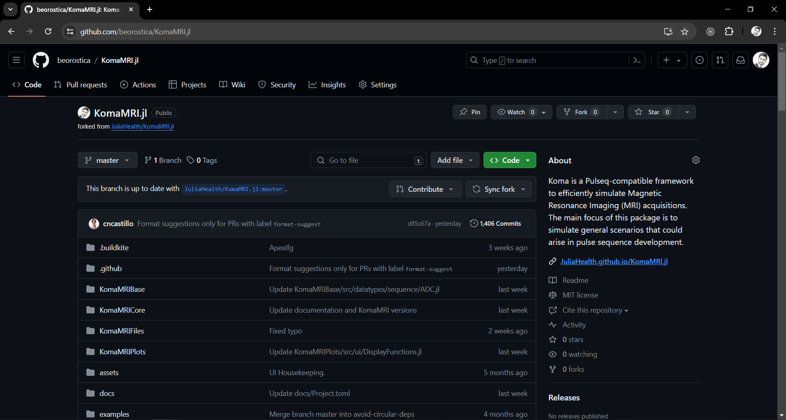
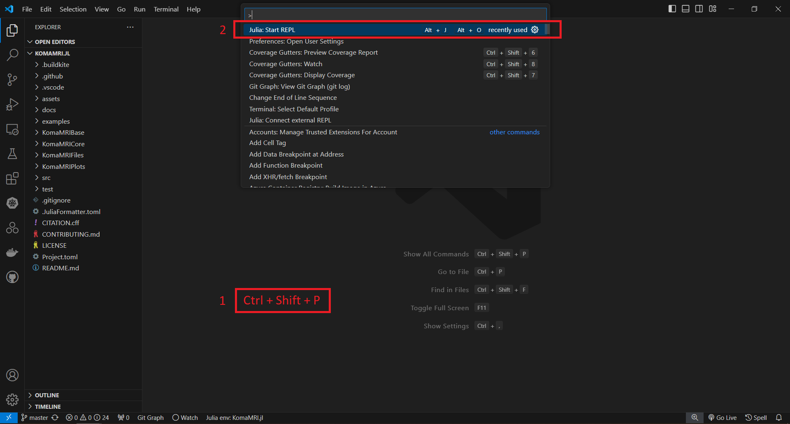
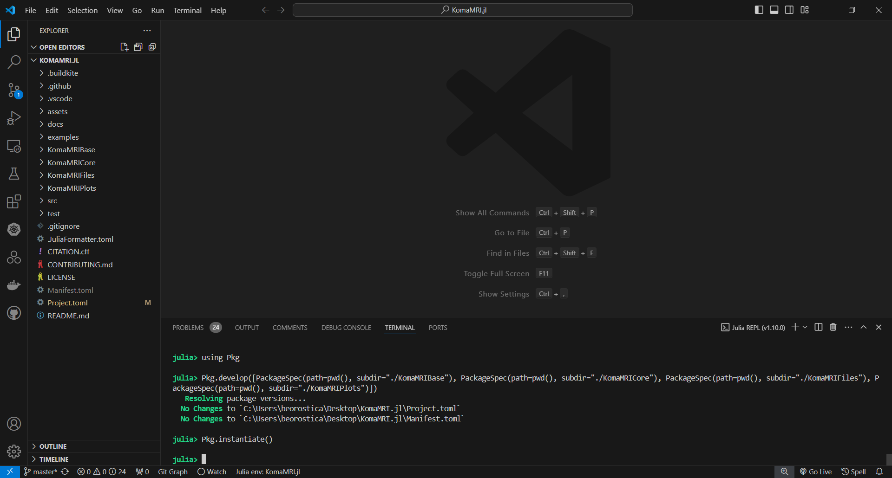
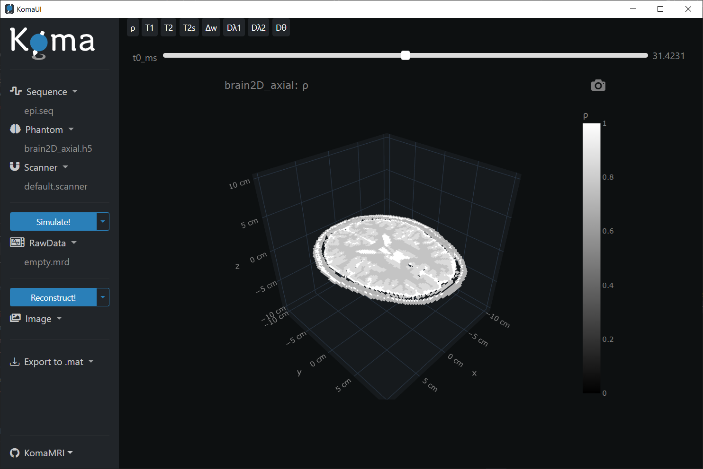
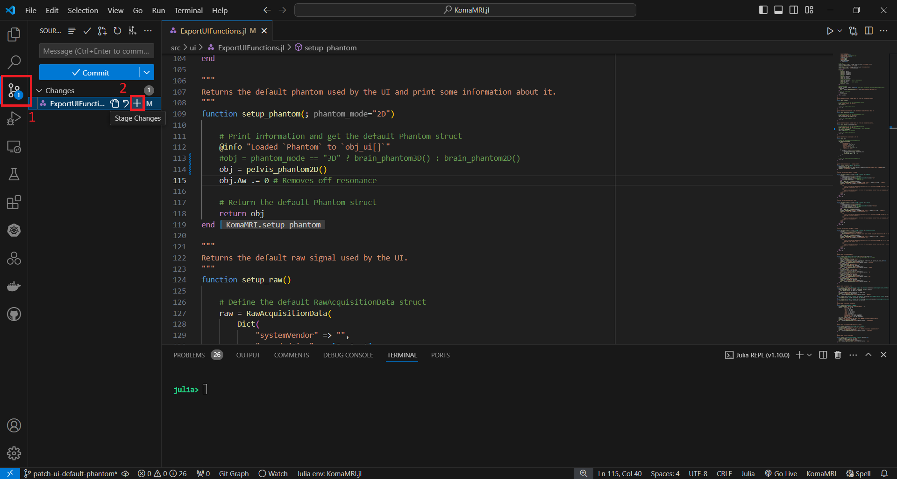

# Advanced Users

If you really want to stay in tune with the most recent features, test some ideas or even contribute to the KomaMRI project, it is necessary to install and configure some tools in your machine:
* Juliaup: this is the manager for installing different versions of Julia.
* Julia: this is the programming language. It is advisable you install it with Juliaup.
* Git: this is a version control system which is handful for coding. [Installation](https://git-scm.com/book/en/v2/Getting-Started-Installing-Git).
* Github: this is a cloud-based Git repository which is handful for managing the KomaMRI project. [Create Account](https://docs.github.com/en/get-started/start-your-journey/creating-an-account-on-github) 
* VScode: this is a code editor with support for development operations. [Installation](https://code.visualstudio.com/docs/introvideos/basics)
* VScode Plugings: they enable VSCode to have more handy features. We recommend you to install the following: "Julia", "Git Graph", "GitHub Pull Requests".

## Setup your Fork of KomaMRI

Once everything is installed, you need to create a fork of the KomaMRI repo in your Github account. Go to the official KomaMRI repo https://github.com/JuliaHealth/KomaMRI.jl and follow the bellow steps:


Now, your fork of KomaMRI should look like this:



Now you need to clone your fork of the KomaMRI repo. Open VScode and do the steps bellow, make sure you replace the `<your-user-name>` with your github user name and select a memorable location to store the local git project:


You should have the git project opened in VScode:


Everything looks good. Let's run KomaMRI, but before you can do so, you need to setup the Julia environment. The information of the environment is ultimately defined by the file `Manifest.toml`, however you don't have that file yet. So you need to create it from the information of the `Project.toml`.

Let's select the environment of our KomaMRI project:


Now, open a Julia REPL:



In the Julia REPL you have to type the following:
```julia-repl
julia> using Pkg

julia> Pkg.develop([PackageSpec(path=pwd(), subdir="./KomaMRIBase"), PackageSpec(path=pwd(), subdir="./KomaMRICore"), PackageSpec(path=pwd(), subdir="./KomaMRIFiles"), PackageSpec(path=pwd(), subdir="./KomaMRIPlots")])

julia> Pkg.instantiate()
```



The `using Pkg` simply imports the `Pkg` module which is the package manager of Julia. The `Pkg.develop(...)` creates the `Manifest.toml` file considering de local folders `KomaMRIBase`, `KomaMRICore`, `KomaMRIFiles` and `KomaMRIPlots`. Finally, the `Pkg.instantiate()` installs all the dependencies from the `Manifest.toml`.

With these steps your environment is setup. You can now run the KomaMRI user interface:
```julia-repl
julia> using KomaMRI

julia> KomaUI()
```


Let's see what is the default phantom in the user interface by clicking in the `Phantom dropdown` and then press the `View Phantom` button:

 

You can close the KomaMRI user interface.


## Make changes to remote repos

So far so good. However you want to make some changes to your Github Fork and even you want to contribute to the KomaMRI project. But baby steps first, let's make some local changes in the local git repo. In the following example we will change the default phantom displayed in the user interface.

First create a branch with a descriptive name, in this case `patch-ui-default-phantom`:


In this new branch, we are going to edit the `setup_phantom` function located in the file `src/ui/ExportUIFunctions.jl`. We simply replace the line where a brain phantom is defined by the function `pelvis_brain2D`: 


Then, you need to compile the function `setup_phantom`, simply put the cursor in a place inside the function `setup_phantom` and then press `Alt + Enter`:


Now, let's see what is the new default phantom in the user interface by clicking in the `Phantom dropdown` and then press the `View Phantom` button:

```julia-repl
julia> KomaUI()
```


Everything looks good, let's stage the changes:



And commit the changes:


Let's upload these changes in your github fork or to the official KomaMRI repo by selecting the `origin` or the `upstream` option:


## About Julia Environments and Subdirectories

So far, the `KomaMRI` package have 4 subdirectories `KomaMRIBase`, `KomaMRICore`, `KomaMRIPlots` and `KomaMRIFiles`. These subdirectories are proper julia packages by themselves, so they have their own `Project.toml` which need to resolve an environment defined ultimately by a `Manifest.toml`.

This is how these packages are related:
* `KomaMRIBase` doesn't depend on any of these other subdirectories.
* `KomaMRICore` depends directly on `KomaMRIBase`
* `KomaMRIPlots` depends directly on `KomaMRIBase`
* `KomaMRIFiles` depends directly on `KomaMRIBase`
* `KomaMRI` depends directly on `KomaMRICore`, `KomaMRIPlots` and `KomaMRIFiles`

If you want to edit only the direct contents of one of these packages, you simply need to activate the julia package and then instantiate to generate the `Manifest.toml`. However, if you want to make changes that involve the packages and it's direct dependencies you need to create an environment that indicates so.

For instance, to edit `KomaMRICore` and its direct dependency `KomaMRIBase`:
```julia-repl
user@machine /path/to/KomaMRI.jl
$ julia

julia> Pkg.activate("KomaMRICore")

julia> Pkg.develop(PackageSpec(; path="KomaMRIBase"))

julia> Pkg.instantiate()
```

For instance, to edit `KomaMRICore` and all the subdirectories:
```julia-repl
user@machine /path/to/KomaMRI.jl
$ julia

julia> Pkg.activate("KomaMRICore")

julia> Pkg.develop([PackageSpec(path=pwd(), subdir="./KomaMRIBase"), PackageSpec(path=pwd(), subdir="./KomaMRICore"), PackageSpec(path=pwd(), subdir="./KomaMRIFiles"), PackageSpec(path=pwd(), subdir="./KomaMRIPlots")])

julia> Pkg.instantiate()
```
